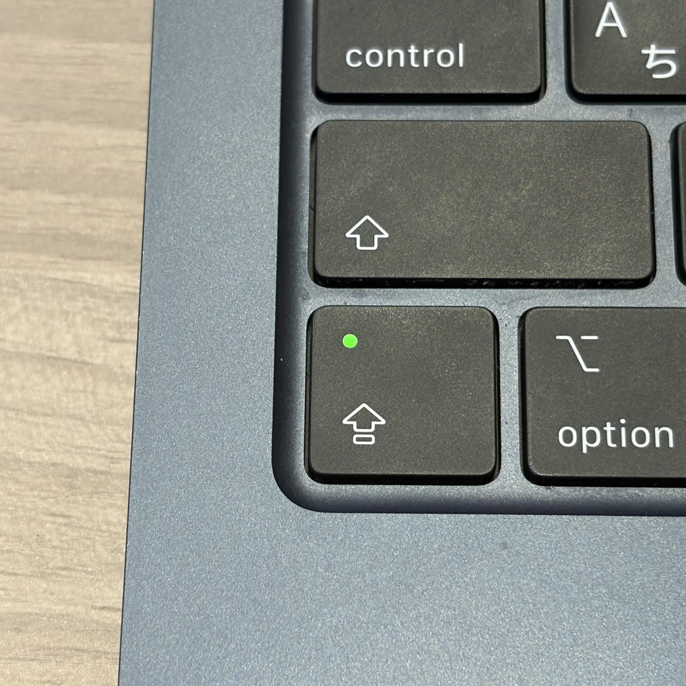

# Capsomnia

<p align="center">
  
</p>

<p align="center">
  <a href="README.md"></a>
  <a href="https://fuji-mak.github.io/Capsomnia/"></a>
</p>

<p align="center">
  <a href="https://github.com/fuji-mak/Capsomnia/actions/workflows/ci.yml"></a>
  
  
  <a href="LICENSE"></a>
</p>

現在のバージョン: `1.0.0`

[English README](README.md) · [`Capsomnia.pkg` をダウンロード](https://github.com/fuji-mak/Capsomnia/releases/latest/download/Capsomnia.pkg)

**Capsomnia** は、Caps Lock を「閉じた MacBook でも作業を止めないための物理スイッチ」にする小さな macOS アプリです。

作業を走らせ続けたいときは Caps Lock をオン。通常のスリープ動作に戻したいときは Caps Lock をオフにします。

AIエージェントの実行、モバイル接続、その他長時間の実行や遠隔での作業に有効です。

<p align="center">
  
</p>

<p align="center">
  <em>この小さいランプが点いている間、Mac は寝ません。</em>
</p>

## クイックスタート

必要なもの:

- macOS 14 以降
- インストール時の管理者権限

署名済みパッケージでインストール:

1. [GitHub Releases](https://github.com/fuji-mak/Capsomnia/releases/latest) から `Capsomnia.pkg` をダウンロード
2. パッケージを開き、インストーラに従う

リリース用パッケージは Developer ID で署名し、Apple の公証を通しています。パッケージは `Capsomnia.app` を `/Applications` に配置し、署名済みネイティブ privileged helper、限定的な sudoers rule、LaunchAgent を設定します。インストール後、Capsomnia が開き、以降はログイン時に自動起動します。

パッケージのビルドとインストール処理は [`scripts/build-pkg.sh`](scripts/build-pkg.sh) と [`scripts/notarize-pkg.sh`](scripts/notarize-pkg.sh) で公開しています。

## ソースからビルド

開発者向けのソースインストールも利用できます。こちらは Swift 6 toolchain が必要です。

```sh
git clone https://github.com/fuji-mak/Capsomnia.git
cd Capsomnia
./scripts/install.sh
```

ソースインストーラはローカルで `Capsomnia.app` をビルドし、`~/Applications/` に配置します。あわせて、同じ helper、sudoers rule、ユーザー LaunchAgent を設定します。

## できること

- Caps Lock オン: MacBookの蓋を閉じてもAIエージェントなどの処理が途切れないようにします。Codex Mobile等による遠隔操作も可能です。Caps Lockのライトが状態を物理的に示します。
- Caps Lock オフ: 通常のスリープ動作に戻ります。
- Caps Lock ON中に蓋を閉じた時: 作業を走らせたまま画面だけスリープします。
- アプリ終了時: 通常のスリープ動作へ戻します。

長時間動くローカルジョブ、AI コーディングエージェント、SSH、ビルド、ダウンロード、放置スクリプトなどを止めたくないときに使う想定です。

## 設定

初回起動時は、Caps Lockスイッチの動作を説明し、次の項目を選べます。

- メニューバーに丸を表示するか
- 蓋を閉じたら画面をオフにするか
- ログイン時に起動するか
- 日本語・英語のどちらを使うか

あとから Capsomnia をもう一度開くと、同じ項目を変更できます。

入力監視の許可は不要です。CapsomniaはローカルのCaps Lock状態だけを250ミリ秒ごとに確認します。以前のバージョンで入力監視を許可した場合は、システム設定から無効にできます。

パッケージインストール後は `/Applications/Capsomnia.app`、ソースインストール後は `~/Applications/Capsomnia.app` から開けます。メニューバー項目を表示している場合は、そこからも開けます。

## なぜ `caffeinate` ではなく Capsomnia か

`caffeinate` は、Mac を開いたまま放置するときの idle sleep 抑止には便利です。一方で MacBook の蓋を閉じる場合は別で、通常の `caffeinate` assertion だけではローカルジョブの継続を安定して期待できません。

Capsomnia は蓋を閉じた状態であっても蓋を開いている状態と同じように処理が続行します。Caps Lockの黄緑色のライトがその状態を視覚的に表します。

## 安全上の注意

- スリープ抑止中の蓋閉じ運用では、発熱やバッテリー消費が増えることがあります。
- Mac を放置する場合は、通気、電源、実行時間を見て使ってください。
- Capsomnia は手動スイッチです。Caps Lock オンは「動かし続ける」、Caps Lock オフは「通常のスリープ動作」です。

## アップデート

パッケージインストールの場合は、[GitHub Releases](https://github.com/fuji-mak/Capsomnia/releases/latest) から最新版のパッケージをダウンロードして実行してください。

ソースインストールの場合は、既存 clone から更新できます。

```sh
cd Capsomnia
git pull
./scripts/install.sh
```

インストールスクリプトは、app bundle、helper、sudoers rule、LaunchAgent を現在のバージョンで上書きします。

## アンインストール

パッケージインストールの場合:

```sh
/Applications/Capsomnia.app/Contents/Resources/uninstall.sh
```

ソースインストールの場合:

```sh
~/Applications/Capsomnia.app/Contents/Resources/uninstall.sh
```

ソース clone から実行する場合は、これと同じです。

```sh
./scripts/uninstall.sh
```

アンインストーラは LaunchAgent を unload し、Capsomnia を停止し、`/Applications` または `~/Applications` の `Capsomnia.app`、helper、sudoers rule を削除し、通常のスリープ動作へ戻します。管理者認証が必要になることがあります。

## セキュリティモデル

メニューバーアプリ本体は root では動きません。ただしシステムのスリープ設定変更には権限が必要なため、固定ネイティブhelperをpasswordless `sudo`経由で呼び出します。helperはコンパイル済み実行ファイルで、shellの起動やshell初期化ファイルの読み込みは行いません。

パッケージで配置するアプリ、helper、システムLaunchAgentは`root:wheel`所有です。パッケージ版helperもアプリと同じDeveloper IDで署名します。Capsomniaは切替直後と以後10秒ごとに実際の`SleepDisabled`状態を確認します。helperが変更できない、状態を確認できない、設定が外部要因でずれた場合は、要求した状態を有効として表示せず、メニューバーの丸を赤色にして5秒後に再同期します。通常メニューバー表示を隠している場合も、エラー中は赤い丸を一時表示します。

Capsomnia 本体はネットワーク通信を行わず、テレメトリを収集せず、アカウントも必要としません。

Capsomniaは入力監視を要求せず、キーボードイベントも読み取りません。ローカルのCaps Lock状態だけを250ミリ秒ごとに確認し、macOSがタイマー起床をまとめられるようtoleranceを設定しています。

インストール後、macOS が「Taketo Fujimaki」のバックグラウンド項目を表示することがあります。これはログイン時に Capsomnia を起動し、クラッシュ後に復帰するための LaunchAgent です。無効にすると、自動起動とクラッシュ復帰が効かなくなることがあります。

クラッシュ復帰が無効または利用できない状態でCapsomniaを強制終了すると、最後のシステムスリープ設定が残る場合があります。その場合は下記の手動復旧コマンドで通常状態へ戻してください。

アプリが呼び出せるのは次の 3 コマンドだけです。

```sh
sudo -n /Library/PrivilegedHelperTools/capsomnia-pmset on
sudo -n /Library/PrivilegedHelperTools/capsomnia-pmset off
sudo -n /Library/PrivilegedHelperTools/capsomnia-pmset display-sleep
```

sudoers rule はこの 3 コマンドに限定されています。helper も `on`、`off`、`display-sleep` だけを受け付け、内部では次の `pmset` だけを実行します。

```sh
/usr/bin/pmset -a disablesleep 1
/usr/bin/pmset -a disablesleep 0
/usr/bin/pmset displaysleepnow
```

## ログとトラブルシュート

ログはここに出力されます。

```text
~/Library/Logs/Capsomnia/
```

スリープ抑止状態を確認する:

```sh
pmset -g | grep SleepDisabled
```

通常のスリープ動作へ手動で戻す:

```sh
sudo pmset -a disablesleep 0
```

LaunchAgent を再起動する:

```sh
launchctl bootout "gui/$(id -u)" /Library/LaunchAgents/com.github.fuji-mak.capsomnia.plist
launchctl bootstrap "gui/$(id -u)" /Library/LaunchAgents/com.github.fuji-mak.capsomnia.plist
```

ソースインストールの場合は、代わりに `$HOME/Library/LaunchAgents/com.github.fuji-mak.capsomnia.plist` を使ってください。

Capsomnia の LaunchAgent は、アプリがクラッシュした場合など正常終了でないときだけアプリを再起動します。起動時に現在の Caps Lock 状態を読み直し、対応するスリープ設定を再適用します。通常の「終了」は正常終了なので、アプリは再起動しません。

helper 権限を確認する:

```sh
sudo -n -l /Library/PrivilegedHelperTools/capsomnia-pmset on \
  /Library/PrivilegedHelperTools/capsomnia-pmset off \
  /Library/PrivilegedHelperTools/capsomnia-pmset display-sleep
```

helper 権限の確認に失敗する場合は、`./scripts/install.sh` をもう一度実行してください。CapsomniaはCaps Lock状態を250ミリ秒ごとに確認するため、物理LEDの切り替えからメニューバーの丸の更新まで最大でおよそ0.25秒かかる場合があります。

## プロジェクトの状態

Capsomnia 1.0.0は最初の正式安定版です。リリース履歴は [CHANGELOG.md](CHANGELOG.md)、脆弱性報告の方針は [SECURITY.md](SECURITY.md) を参照してください。

## ライセンス

MIT
